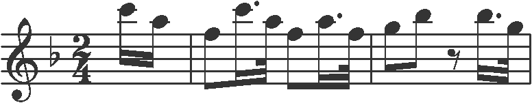

# Music-Sheet-Scanner-CNN
Convolutional Neural Network for Sheet Scanning and Symbol Identification in Optical Music Recognition

This project is the culmination of my final year at university, where I have developed a Convolutional Neural Network (CNN) for sheet scanning and symbol identification in Optical Music Recognition (OMR). For this project, I have made use of the semantic pre-trained CNN model available on GitHub from the [tf-end-to-end repository](https://github.com/OMR-Research/tf-end-to-end).
  
The project workflow can be summarized as follows:

1. Utilizing utility functions to preprocess input images.
2. Processing the image through the CNN model to obtain a list of labels.
3. Applying the Connectionist Temporal Classification (CTC) algorithm to the labels, mapping them to musical symbols stored in the vocabulary file.
4. Enhancing the readability of the musical symbols through a dedicated function.
  
  
  **Key Aspects**
  
  * Pre-trained Convolutional Neural Network (CNN): This project extensively utilizes a pre-trained CNN model, providing reliable and accurate results. More information about this CNN model can be found in the paper [End-to-End Neural Optical Music Recognition of Monophonic Scores](https://www.mdpi.com/2076-3417/8/4/606).
  * Code Adaptation: Initially, the project was implemented and executable via the command line. To ensure smooth execution within Jupyter notebook, the code has been modified accordingly.
  * TensorFlow Compatibility: Compatibility with the pre-trained model has been ensured by incorporating ```tf.compat.v1.disable_v2_behavior()```. This step disables TensorFlow version 2 behavior to overcome compatibility issues with certain libraries required by this model.

  
  **Testing results**
  
  Upon thorough testing, the system has demonstrated excellent performance and speed when processing single-stave images. However, it encounters challenges when recognizing musical sheets with multiple staves, occasionally resulting in erroneous or no output messages.

For instance, when provided with a single-stave image containing hand-written musical symbols, the system successfully identified some of the symbols. However, due to the lack of clarity in the image, it failed to recognize all the symbols accurately.
  
  
  **Input**
  
  
  
  **Output**
  
```G clef line 2, key signature F M, time signature 2/4, note C6 (sixteenth), note A5 (sixteenth), barline, note F5 (eighth), note-C6_sixteenth., note-A5_thirty_second, note F5 (eighth), note-A5_sixteenth., note-F5_thirty_second, barline, note G5 (eighth), note Bb5 (eighth), rest eighth, note-Bb5_sixteenth., note-G5_thirty_second, barline```
